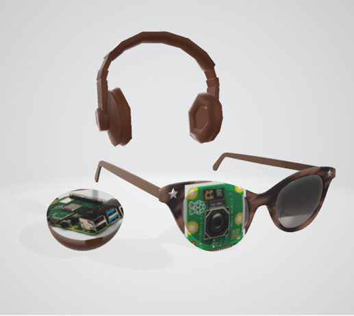

#  Intelligent Glasses Project

[![Contributors][contributors-shield]][contributors-url]
[![Forks][forks-shield]][forks-url]
[![Issues][issues-shield]][issues-url]
[![Stargazers][stars-shield]][stars-url]
[![LinkedIn][linkedin-shield]][linkedin-url]

  

### About the prject

This is the final version of Smart glasses. I placed the camera on the glasses so it moves with the user's head. The model is inside a box, and I added a headset for audio output. When the camera detects an object or person, the headset announces its name to assist the blind user.

(<a href="#readme-top">back to top</a>)

### Functionality of the project

Object detection

Face recognition

Play the name of the detected object

Mobile application that records/registers all detected objects

(<a href="#readme-top">back to top</a>)

(<a href="#readme-top">back to top</a>)

<!-- MARKDOWN LINKS & IMAGES -->

[contributors-shield]: https://img.shields.io/github/contributors/LAAOUAFIFATIHA/intelligent_glasses?style=for-the-badge
[contributors-url]: https://github.com/LAAOUAFIFATIHA/intelligent_glasses/graphs/contributors

[forks-shield]: https://img.shields.io/github/forks/LAAOUAFIFATIHA/intelligent_glasses?style=for-the-badge
[forks-url]: https://github.com/LAAOUAFIFATIHA/intelligent_glasses/network/members

[issues-shield]: https://img.shields.io/github/issues/LAAOUAFIFATIHA/intelligent_glasses?style=for-the-badge
[issues-url]: https://github.com/LAAOUAFIFATIHA/intelligent_glasses/issues

[stars-shield]: https://img.shields.io/github/stars/LAAOUAFIFATIHA/intelligent_glasses?style=for-the-badge
[stars-url]: https://github.com/LAAOUAFIFATIHA/intelligent_glasses/stargazers

[linkedin-shield]: https://img.shields.io/badge/-LinkedIn-black.svg?style=for-the-badge&logo=linkedin&colorB=555
[linkedin-url]: https://www.linkedin.com/in/fatiha-laaouafi-4227252ba/

[stars-shield]: https://img.shields.io/github/stars/LAAOUAFIFATIHA/PickSchool_Flutter_project?style=for-the-badge
[stars-url]: https://github.com/LAAOUAFIFATIHA/PickSchool_Flutter_project/stargazers
