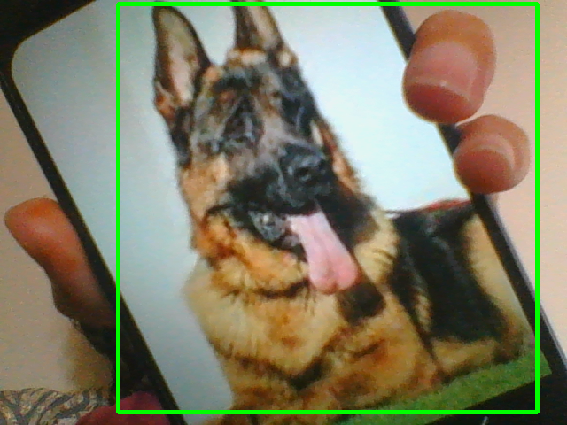
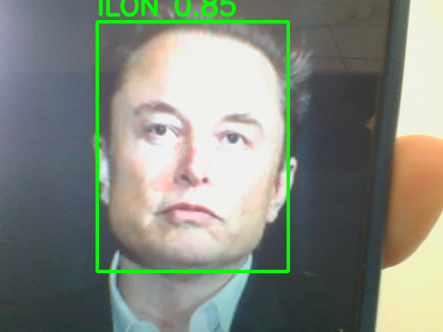

#  Intelligent Glasses Project

[![Contributors][contributors-shield]][contributors-url]
[![Forks][forks-shield]][forks-url]
[![Issues][issues-shield]][issues-url]
[![Stargazers][stars-shield]][stars-url]
[![LinkedIn][linkedin-shield]][linkedin-url]

  

### About the prject

This is the final version of Smart glasses. I placed the camera on the glasses so it moves with the user's head. The model is inside a box, and I added a headset for audio output. When the camera detects an object or person, the headset announces its name to assist the blind user.

(<a href="#readme-top">back to top</a>)

### Functionality of the project

- Object detection

- Face recognition

- Play the name of the detected object

- Mobile application that records/registers all detected objects

### Object detection and Face recognition
For this part of the project, I implemented object detection using YOLOv8 (You Only Look Once, version 8), one of the most advanced and efficient deep learning models for real-time detection.

Model: YOLOv8 by <a href="https://github.com/ultralytics/ultralytics"> Ultralytics</a>

Task: Object detection on images and video streams

#### Features:

Detects multiple objects simultaneously with high accuracy

Provides bounding boxes, class labels, and confidence scores

Optimized for speed and can run on both CPU and GPU

#### where i have use it ?:

Real-time detection of objects from a camera feed

Logging and registering detected objects in the system

Future extension for mobile application integration 
   

  
  

 
By using YOLOv8, this project benefits from state-of-the-art accuracy and real-time performance, making it suitable for practical applications such as smart vision systems, surveillance, and assistive technologies.

(<a href="#readme-top">back to top</a>)

### Play the name of the detected object
The Raspberry Pi camera provides a continuous video stream to the Raspberry Pi, where the YOLOv8 model is installed. Once an object is detected, the system instantly plays the object’s name through a headset, allowing blind or visually impaired users to recognize their surroundings in real time. This audio feedback offers immediate awareness of nearby people and objects, enabling users to navigate more safely, independently, and confidently while enhancing their interaction with the environment.

   

  

(<a href="#readme-top">back to top</a>)

 ### Mobile application that records/registers all detected objects
The mobile application is linked to a database where the Raspberry Pi sends images of the detected objects. The application retrieves these images from the database, allowing users to view and review all detected objects conveniently. This setup ensures seamless storage, access, and management of detections for better tracking and analysis.

   

  

<!-- MARKDOWN LINKS & IMAGES -->

[contributors-shield]: https://img.shields.io/github/contributors/LAAOUAFIFATIHA/intelligent_glasses?style=for-the-badge
[contributors-url]: https://github.com/LAAOUAFIFATIHA/intelligent_glasses/graphs/contributors

[forks-shield]: https://img.shields.io/github/forks/LAAOUAFIFATIHA/intelligent_glasses?style=for-the-badge
[forks-url]: https://github.com/LAAOUAFIFATIHA/intelligent_glasses/network/members

[issues-shield]: https://img.shields.io/github/issues/LAAOUAFIFATIHA/intelligent_glasses?style=for-the-badge
[issues-url]: https://github.com/LAAOUAFIFATIHA/intelligent_glasses/issues

[stars-shield]: https://img.shields.io/github/stars/LAAOUAFIFATIHA/intelligent_glasses?style=for-the-badge
[stars-url]: https://github.com/LAAOUAFIFATIHA/intelligent_glasses/stargazers

[linkedin-shield]: https://img.shields.io/badge/-LinkedIn-black.svg?style=for-the-badge&logo=linkedin&colorB=555
[linkedin-url]: https://www.linkedin.com/in/fatiha-laaouafi-4227252ba/

[stars-shield]: https://img.shields.io/github/stars/LAAOUAFIFATIHA/PickSchool_Flutter_project?style=for-the-badge
[stars-url]: https://github.com/LAAOUAFIFATIHA/PickSchool_Flutter_project/stargazers
